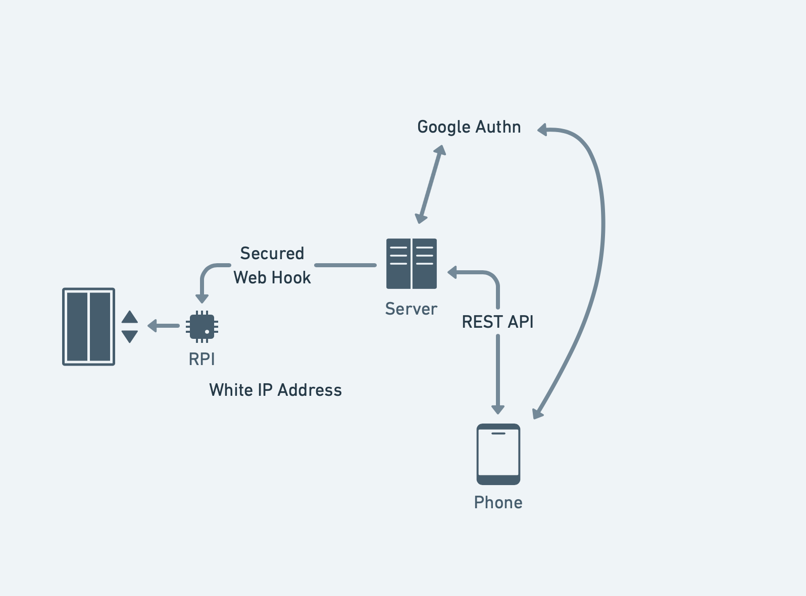

# Table of Contents
- [Introduction](#Introduction)
- [Projects](#Projects)
- [Mobile App](#Mobile-App)
- [Client for Server](#Client-for-Server)
- [Client for Raspberry Pi](#Client-for-Raspberry-Pi)
- [Documentation](#Documentation)

# Introduction

The main purpose of project to call elevator in Effective office without using physical key.

# Projects

## Mobile App
Android&iOS app has an authorization via Google account and screen with elevator button

## Client for Server
This client performs validation and requests elevator call on Raspberry PI

## Client for Raspberry Pi
This client makes call directly to the elevator via GPIO_01 pin

### Interaction diagram: 

# Documentation

- [Mobile apps for Android and iOS](mobile-app/README.md)
- [Server api client](server-client/README.md)
- [Raspberry api client](raspberry-client/README.md)
