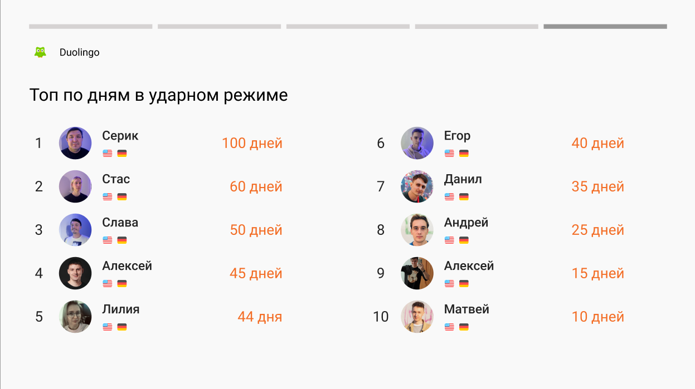

# Effective-Office-EffectiveTV

## Goal :dart:
The main purpose of the subproject is to show information about employees (such as ah birthdays, anniversaries of work in the company, joining the team and duolingo score of each employee) in the format of stories.

## Screenshots 	:camera_flash:

### Stories types

|                      Birthdays                       |                 Anniversary of working                 |
|:----------------------------------------------------:|:------------------------------------------------------:|
|  |  |

|                       New employee                       |                   Duolingo top on XP                    |
|:--------------------------------------------------------:|:-------------------------------------------------------:|
|  |  |

|              Duolingo top of the day in shock mode              |
|:---------------------------------------------------------------:|
|  |

## Features :fire:

The subproject contains stories screen, which fetches data from notion database and displays actual info about effective employes, which may fit the definition of one of these story types:

### Birthdays: :birthday:

Show employee name, photo and congratulatory text.

### Anniversary of working for the company: :star:

Shows employee name, photo and congratulatory text, with the number of years with the company.

### New employee: :baby_chick:

Shows employee name and congratulatory text.

## Duolingo

Since a lot of people in the company are learning languages with the [Duolingo](https://ru.duolingo.com/) app, we decided to use their API to display the statistics for the week, thus motivating more people to start paying attention to learning new languages and do it more consistently. There are currently the following types of stories for duolingo:

### Duolingo top on XP: 🥇

Shows duolingo top of employees by xp, with their names, photo, languages and all time XP.

### Duolingo top of the day in shock mode: ⚡

Shows duolingo top by number of days in stike mode.

The screen also contains buttons that can be used to interact with stories (switch, pause or resume). You can see them by pressing the down button on the remote control. The screen can be started in two formats: separate from all or be added to the autoplay to play with another screens, using autoplay menu.

## Used libraries 📚

A list of technologies used within the project:
* DI: [Hilt](https://dagger.dev/hilt/)
* Notion: [Notion-sdk-jvm](https://github.com/seratch/notion-sdk-jvm)
* Multithreading: [Kotlin Flow](https://kotlinlang.org/docs/flow.html) and [Coroutines](https://kotlinlang.org/docs/flow.html)
* Image loading: [Coil](https://coil-kt.github.io/coil/)

## Authors: :writing_hand:

[Artem Gruzdev](https://github.com/gull192)
[Egor Parkomenko](https://github.com/1MPULSEONE)
[Stanislav Radchenko](https://github.com/Radch-enko)

## Guidelines for starting up: :computer:

In order to build all parts of project, you will need JDK and Android Studio. We are using this versions:

Android Studio Electric Eel: Version 2022.1.1

JDK: Version 11.0.15

To start the project, you will need to add the fields required for build config in the local.properties file. The required values for these fields can be found in the relevant section on the project page in Notion.

## Running an application using gradle: :arrow_forward:

1. Open the terminal and go to the root directory of the project.

2. Run the ./gradlew assembleDebug command to assemble the project in debug mode.

3. To run the application on an emulator or connected device, run the ./gradlew installDebug command.

4. If you want to run tests, run the command ./gradlew test.

5. If you want to assemble the APK file for the release version, run the command ./gradlew assembleRelease.

## Third-party docs: :page_with_curl:

[Notion sdk](https://github.com/seratch/notion-sdk-jvm)

